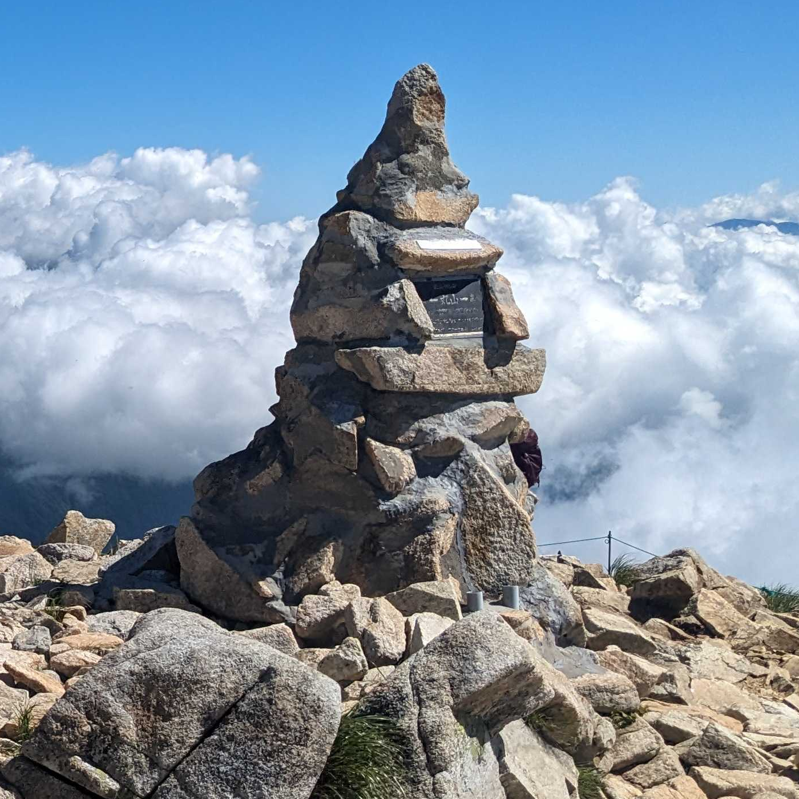
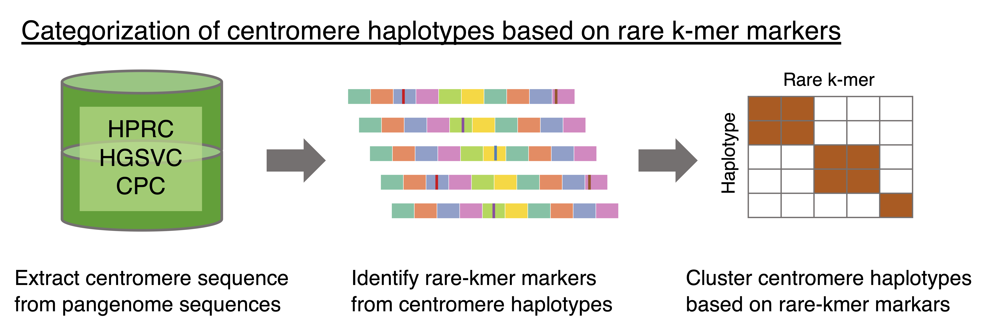

<div align="center">
  
  <p>Maruyama cairn at Mt. Karamatsu</p>
</div>

# ascairn
It has become clear that centromere sequences, especially alpha satellite sequences, exhibit considerable variation.
We have demonstrated that centromeres can be classified using rarely observed k-mers (Sugawa et al., in preparation).
`ascairn` (alpha-satellite cairn) is software designed to perform various analyses, including estimating centromere variation from short-read data by utilizing rare k-mers within centromere sequences

<div align="center">
  
</div>

# Prerequisites
## Software
- [samtools](https://github.com/samtools/samtools)
- [Jellyfish](https://github.com/gmarcais/Jellyfish)
- [mosdepth](https://github.com/brentp/mosdepth)

## Python
- click
- scipy 
- polars
- boto3 (required only for accessing CRAM files in Amazon S3)
  
# Installation

1. Install prerequisite software and ensure they are accessible via your `PATH`.

2. Install `ascairn`.
```bash
git clone https://github.com/friend1ws/ascairn.git
cd ascairn
pip install .   # or pip install -e . for development
```

3. Download ascairn resource files.
```bash
git clone https://github.com/friend1ws/ascairn_resource.git
```

After installation, your directory structure may look like this:
```
ascairn/
ascairn_resource/
```

# Mini-Tutorial

This mini-tutorial demonstrates how to execute a standard workflow using `ascairn_type_allchr.sh`. 
This tutorial can be easily extended to any sequence data aligned to the GRCh38 reference genome.


## Procedure

### 1. Prepare the sequence data

Download sequence data (aligned to the GRCh38 reference genome) using one of the following methods:

**Option 1: AWS S3 (recommended for faster downloads)**
```
aws s3 cp s3://1000genomes/1000G_2504_high_coverage/additional_698_related/data/ERR3989340/NA12877.final.cram seq_data/
aws s3 cp s3://1000genomes/1000G_2504_high_coverage/additional_698_related/data/ERR3989340/NA12877.final.cram.crai seq_data/
```

> If you have direct access to AWS S3 BAM or CRAM files and SAMtools is properly installed, you can skip downloading the files locally. Instead, directly specify the S3 path in subsequent steps.


**Option 2: FTP**
```
wget ftp://ftp.sra.ebi.ac.uk/vol1/run/ERR398/ERR3989340/NA12877.final.cram -P seq_data/
wget ftp://ftp.sra.ebi.ac.uk/vol1/run/ERR398/ERR3989340/NA12877.final.cram.crai -P seq_data/
```


### 2. Execute the `ascairn_type_allchr.sh` script

Run the following command (runtime: approximately 20–30 minutes):
```
bash ascairn_type_allchr.sh seq_data/NA12877.final.cram output/NA12877 ascairn_resource/resource/ver_2024-12-06 hg38 8
```

**Argument descriptions:**

```
 ascairn_type_allchr2.sh <BAM_FILE> <OUTPUT_PREFIX> <DATA_DIR> <REFERENCE: hg38|chm13> [THREAD_NUM]
```

| Argument         | Description                                    | Default |
|------------------|------------------------------------------------|---------|
| First argument   | Path to BAM or CRAM file                       | —       |
| Second argument  | Output path prefix                             | —       |
| Third argument   | Reference genome for BAM file (hg38 or chm13)  | —       |
| Fourth argument  | Number of threads to use                       | 8       |


**Result**
After successful execution, the output file will be generated at:
```
output/NA12877.cen_type.result.txt
```

## Inside the workflow 

- `check_depth`　
  - Check sequence coverage in a reference region (chr22 long arm).
  - Determine biological sex by comparing coverage in chrX (short arm) to the reference region.
  - Assumes the BAM/CRAM is aligned to hg38 (or chm13 with matching BEDs).

```bash
ascairn check_depth　\
  seq_data/NA12877.final.cram　\
  ascairn_resource/resource/ver_2024-12-06/chr22_long_arm_hg38.bed output/NA12877.depth.txt　\
  --x_region_file /home/yuishira/bin/ascairn_resource/resource/ver_2024-12-06/chrX_short_arm_hg38.bed　\
  --threads 8
# output: coverage stats (including genome-wide mean, chr22 ref region, chrX short arm)
```

- `kmer_count` 
  - Extracts reads aligned to alpha satellite regions and counts occurrences of predefined rare k-mers.
  - Assumes the BAM/CRAM is aligned to hg38 (or chm13 with matching BEDs).
 
```bash
ascairn kmer_count　\
  seq_data/NA12877.final.cram　\
  ascairn_resource/resource/ver_2024-12-06/rare_kmer_list.fa　\
  ascairn_resource/resource/ver_2024-12-06/cen_region_curated_margin_hg38.bed　\
  output/NA12877.kmer_count.txt　\
  --threads 8
# output: per-k-mer counts
```

- `type`
  - Identify centromeric cluster pairs and nearest haplotype pairs for chr1–22 and chrX.

```bash
COV=37.24   # from `ascairn check_depth`

for CHR_IND in $(seq 1 22) X
do
  ascairn cen_type　\
    output/NA12877.kmer_count.txt \
    output/NA12877.chr${CHR_IND} \
    ascairn_resource/resource/ver_2024-12-06/kmer_info/chr${CHR_IND}.kmer_info.txt.gz \
    ascairn_resource/resource/ver_2024-12-06/cluster_m3/chr${CHR_IND}.cluster_marker_count.txt.gz \
    ${COV}　\
    --cluster_haplotype_file ascairn_resource/resource/ver_2024-12-06/cluster_m3/chr${CHR_IND}.hap_cluster.txt
done
# output: per-chromosome typing results
# add --is_single_hap option for male
```

